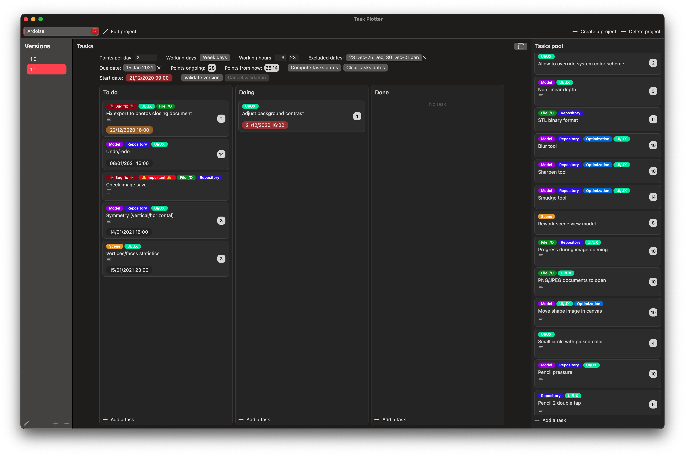

# Task Plotter

Task Plotter is one of the helper apps I use when developing other apps.

Inspired by the interface of Trello (note that there are no collaboration features here), it allows to create *tasks* with associated *costs* and to organize them by *versions* for a *project*. 

## Schedule generation

For a version, you can define the estimated number of *points done per day*, *working days* in the week and *working hours*. You can also *exclude dates* on which you won't be working. 
Then, if you add a *due date*, you can compute the **estimated due date by task**. 

The algorithm assumes you will work on **Doing** tasks first (top to bottom), then the **To do** tasks (top to bottom), and simply produces the date at which each task should be done in order to meet the schedule, given the estimations.
(**Done** tasks are not counted in the estimation.)

It will also give you an **estimated date to start** (which is simply the due date of the first task to do minus its estimation).

## Secondary features 

- Allows to create labels for a project and assign them, in any order, to tasks.
- Shows the **points ongoing** (sum of the costs of all **To do**/**Doing** tasks in the current version) and **points from now** (points available until the due date if you start working on it right now).
- Allows to move a task to another version by right-clicking on it.
- Allows to validate a version, which for now, doesn't do much expect showing the start date in green.

## To do

- Create a pool of tasks that can be filtered/sorted and dragged from/to a version.
- Add stats when validating a version? (Effective points per day, completion rate of short/medium/long tasks, ...)
